# Linux-Vortrag

Winterophase 19/20

Heiko Carrasco

## Vortragsfolien


[https://tinyurl.com/linux-vortrag](https://tinyurl.com/linux-vortrag)

## About me
+ Heiko Carrasco
+ Linux Nutzer seit ~2009
+ Komplett umgestiegen ~2012

## Was ist Linux?
> Als Linux oder GNU/Linux bezeichnet man in der Regel freie, unix-ähnliche Mehrbenutzer-Betriebssysteme, die auf dem Linux-Kernel und wesentlich auf GNU-Software basieren.

. . .

Wikipedia

## Warum mit Linux beschäftigen?
+ Es wird euch (viel) im Studium begegnen
+ Viele relevante Studiumsangelgenheiten werden leichter

## Warum ein Vortrag und kein Workshop?
+ Mehr Leute erreichen
+ Einblick geben
+ Installationsworkshop im nächsten Slot

# Geschichte {data-background-video="img/history.mp4" data-background-video-loop="true"}

## Wer hat es erfunden?


. . .

Linus Torvalds

## Geschichte
+ Am Anfang war das Betriebssystem Unix (1973)
+ Entwickelt von Ken Thompson und Dennis Ritchie (Bell Labs)
+ Ziel: Möglichst einfaches Design
	+ Alles ist eine Datei
	+ Programme sind klein und simpel
+ Sehr erfolgreich, viele Nachbauten

## Evolution of Unix
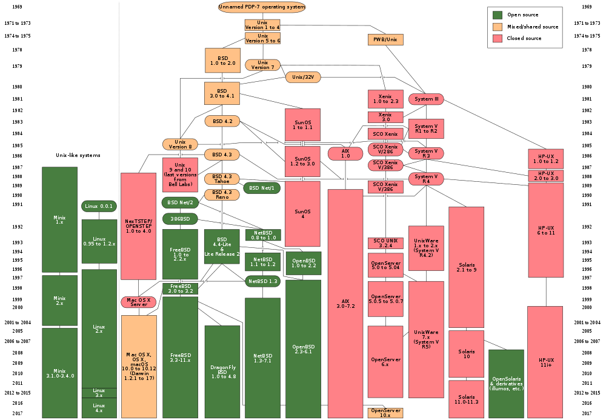{height=500px style="background:white;"}

## Geschichte
+ Torvalds, damals Studi, wollte seinen eigenen Kernel bauen
+ Sehr viele Konzepte von Unix übernommen
+ OpenSourced unter dem Namen Linux (Linus + Freax)

## Tux
+ Wettbewerb für ein Linux Logo

. . .

{style="background:white;"}

# Open Source {data-background-video="img/matrix.mp4" data-background-video-loop="true"}

## Was ist *nicht* Open Source?
+ meiste Programme sind in Hochschprachen geschrieben (Java, C++, Go, etc.)
+ werden mithilfe von Compilern in Maschineninstruktionen übersetzt
+ komerzielle Software wird häufig nur in der kompilierten Fassung verteilt
+ manchmal zusätzlich *obfuscated*

## Was bedeutet das?
+ Kein Einblick in die Funktionsweise eines Programms
+ Keine Änderungsmöglichkeiten
+ Vollständige Abhängigkeit vom Hersteller

## Was ist Open Source?
+ Quellcode ist öffentlich
+ Code steht oft unter einer OpenSource Lizenz (z.B. GNU, Apache, MIT, etc.)
	+ Code darf modifiziert werden
	+ Regelungen was die Weiterverbreitung betrifft
	+ Free/Libre Open Source Software

## Bekanntere Projekte

:::::::::::::: {.columns}
::: {.column width="30%"}

:::
::: {.column width="30%"}

:::
::: {.column width="30%"}

:::
::::::::::::::

## pyophase
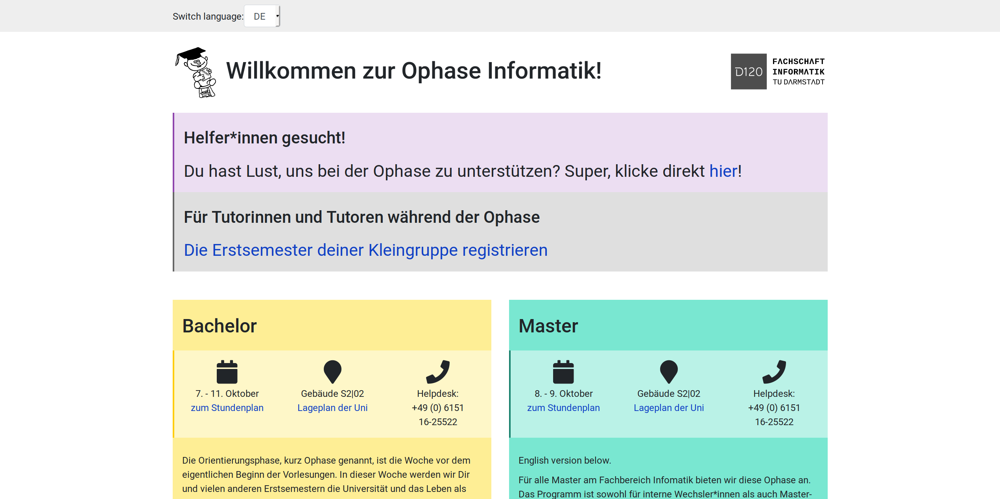

## pyophase
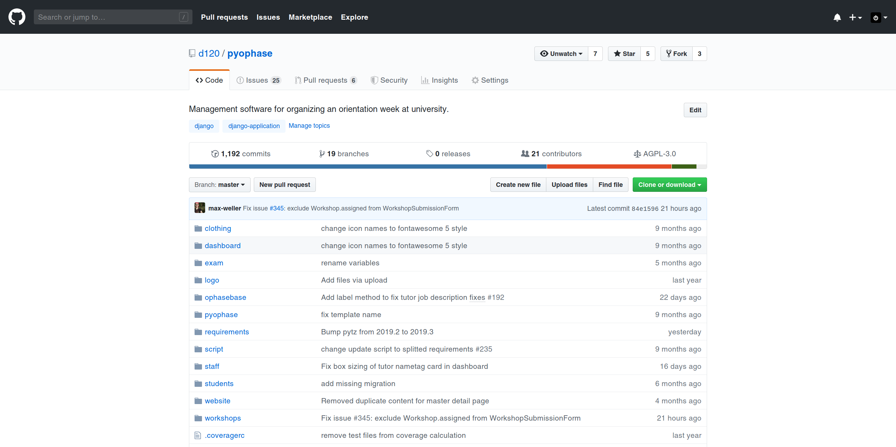

## Warum ist das ziemlich cool?
+ Weniger Sicherheitslücken (Viele-Augen-Prinzip)
	+ vor allem weniger/keine Backdoors
+ Lernen durch Code Anderer
+ Kollaboratives Arbeiten
+ Beteiligung an Open Source Projekten als Aushängeschild/CV

# Vorteile von Linux{data-background-video="img/cute_pingu.mp4"}

## Weniger Ressourcenverbrauch
+ Linux braucht weniger Leistung als Windows (bei gleicher Benutzung)
+ Programme und Betriebssystem starten und arbeiten schneller
+ Abstürze sind sehr selten
+ Auch für ältere PCs geeignet

## Kostenlos
+ Linux ist kostenlos
	+ Einige Anbieter verlangen Geld für besonderen Support
+ Passende Software meistens auch gratis
+ Lebenslange Updates

## Community Support
+ bei Problemen hilft eine große Community
+ viele Blogs und Foren bieten Lösungen auch für obskure Fragen an
+ Chatrooms als Austausch- und Frageplattform

## Privatsphäre
+ Linux schickt nicht alle eure Daten an Dritte
+ falls benötigt, werden User vorher gefragt
	+ Beispiele: Crash Reports, anonyme Telemetrie, etc.
+ Gesammelte anonyme Daten häufig öffentlich verfügbar

# Paketverwaltung {data-background-video="img/package.mp4" data-background-video-loop="true"}

## Installieren von Software unter Windows

## 1. Installer finden
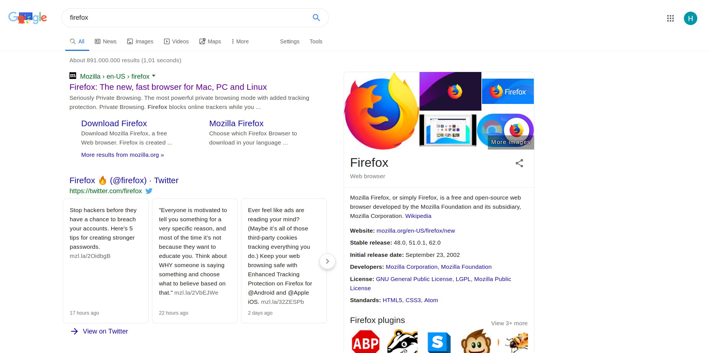

## 2. UAC bestätigen

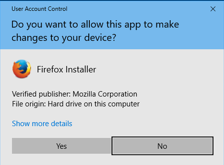

## 3. Installer durcklicken

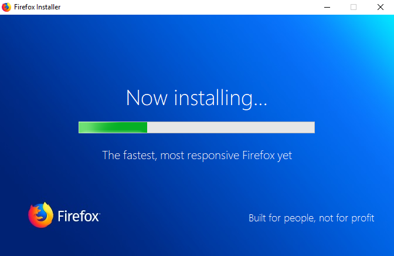


## 4. Profit

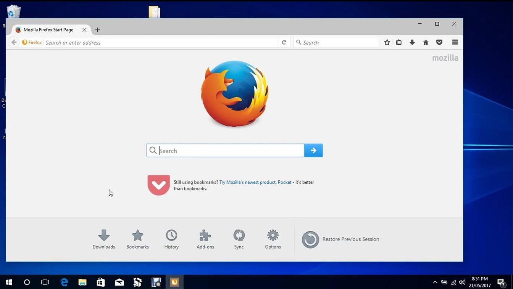

## Installieren von Software unter Linux
+ Linuxdistributionen haben meistens eine Paketverwaltung
+ Damit lassen sich Programme mit einem Klick bzw. einem Kommando nachinstallieren
+ Abhängigkeiten zu anderen Programmen werden intelligent gelöst
+ Anwendungen werden zentral up-to-date gehalten

## Demo

## Vorteile gegenüber Windows
+ Keine hundert Updater, sondern ein zentrales System
+ Keine „Extras“ wie Toolbars beim Installieren
+ Selbst entscheiden wann Updates installiert werden

# Shell {.slide: data-background-video="img/hackerman.mp4" data-background-video-loop="true"}

## Shell
+ Programm, welches Befehle entgegenimmt und ausführt
+ erlaubt das interaktive Starten und Steuern von Programmen
+ Beispiele: bash, zsh, fish, etc.

## Shell

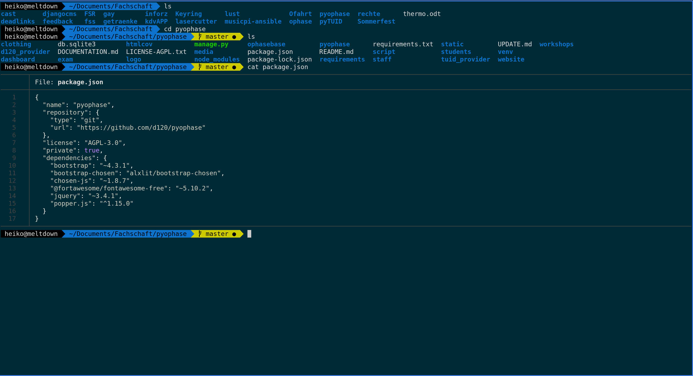{height=450px}

## Befehle
+ mehrere Kategorien
+ Datei- und Ordneroperationen
	+ Informationen und Veränderungen von Dateien
	+ z.B. `cd, ls, cat`
+ Systemverwaltung
	+ Zustand des Systems einsehen und ändern
	+ z.B. `htop, pkill`
+ sonstige Programme
	+ z.B. `git, man`

## Argumente und Pipe
+ Können mit Argumenten gesteuert werden
	+ `ls` gibt alle Dateien in einem Ordner aus
	+ `ls -l` zeigt zusätzlich Informationen wie „Besitzer“ etc. an
+ Mit | kann die Ausgabe eines Befehls in einen anderen geleitet werden
	+ z.B. `cat text.txt | grep -i hello`

## Hilfe
+ häufig existieren manuals, erreichbar mit `man`
+ zusätzlich gibt es oft auch `--help`
	+ Beispiel: `man grep` oder `grep --help`

## Wozu braucht man das?
+ Schnelle und einfache Ausführung von Programmen
+ Einfach Automatisierung von häufigen Tasks
+ Fernzugriff

## Demo

# Linux im Studium {data-background-video="img/study.mp4"}

## FOP
+ Hausübungen in Java und Racket
+ Müssen auf den (Linux-)Poolrechnern laufen!
+ Was wenn die Uni schon zu hat?

##
### SSH
+ Einfacher Zugang zu entfernten Rechnern
+ ISP stellt mehrere virtuelle Poolrechner bereit

. . .

```bash
ssh hc82bydi@clientssh1.rbg.informatik.tu-darmstadt.de
```

## Demo

## FOP-Projekt & Bachelorpraktikum
+ Größeres Programmierprojekt
+ Mehrere Leute arbeiten am gleichen Code
+ Problem: Wie synchronisiert man den aktuellen Stand?

##
### GIT
+ Versionskontrollsystem des Linux Kernels
+ Verschiedene Teile des Projekts können verteilt bearbeitet werden
+ Weitere praktische Features wie Merges, Branches, etc.

. . .

```bash
git add test.racket
git commit -m "Neuer Test"
git push
```

## Demo

## Mathe 1,2 AFE
+ Abgabe von Hausübungen
+ Handschrift vielleicht nicht lesbar
+ Formeln in Word eingeben ist mühsam

##
### LaTeX
+ Schriftsatzsystem mit Fokus auf wissenschaftliches Schreiben
+ sehr „schöne“ Dokumente
+ Coporate Design der TU einfach installierbar

## Demo

# Distributionen {data-background-video="img/trumpdistribution.mp4" data-background-video-loop="true"}

## Distros
+ Sammlungen von Programmen und Konfigurationen
+ Oft mit einer eigenen Paketverwaltung
+ Bieten installierbare CD- bzw USB Abbilder an
+ Meistens von Communities oder Firmen veröffentlicht

## Beispiele


##
{height=80px style="background:white"}

+ Gute Einstiegsdistribution
+ Guter Support
+ Zwei Releases pro Jahr
+ Schönes Design

##
{height=100px style="background:white"}

+ „Entwicklerdistribution“
+ Sehr schnelle Updates
+ Viele Drittanbieterrepos mit copr

##
{height=100px style="background:white"}

+ Stabiles Linux ohne viel Aufheben
+ Eher Long Term Stable (LTS)
	+ vier Jahre Updates pro Major Release
+ Vor allem bekannt durch den selbstentwickelten Cinnamon Desktop

# Desktop-Umgebungen {.slide: data-background-image="img/xp-blur.jpg"}

## Desktop-Umgebungen
+ Wahl zwischen verschiedenen Nutzeroberflächen
+ Oft mit Sammlungen von Programmen
+ Weitere Anpassungen möglich

## Gnome


## KDE


## Cinnamon


## i3
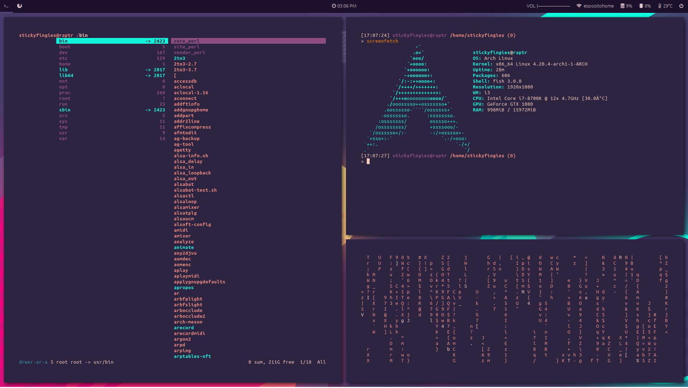


# Dateisystem {data-background-video="img/filesystem.mp4" data-background-video-loop="true"}

## Dateisystem
+ Anders strukturiert als bei Windows
+ Konsole arbeitet direkt mit Dateien

## Die Ordnerstruktur
+ / \- oberstes (root) Verzeichnis (C:\\)
+ /boot \- beim Start benötigte Dateien
+ /etc \- Globale Einstellungen
+ /home \- Verzeichnisse der Nutzer*innen
+ /tmp \- temporäre Dateien
+ /usr \- Systemteile, Software, Bibliotheken

## Home-Verzeichnis
+ Persönliche Daten (Dokumente, Downloads, etc.)
+ Viele config Dateien
	+ einfach zu kopieren und zu backupen

## Wie funktioniert es?
+ Dateien haben Eigentümer*innen und Gruppenzugehörigkeiten
+ Dateien haben Attribute (read, write execute)

# Sicherheit{data-background-video="img/secure-policy.mp4"}

## Warum ist Linux sicher(-er)?
+ Wenig Verbreitung == weniger Viren
+ schnelle Sicherheitsupdates in den Repositories
	+ Software aus Repos ist meistens sicher
+ gute Rechteverwaltung

## Rechteverwaltung
:::::::::::::: {.columns}
::: {.column width="50%"}
{.fragment}
:::
::: {.column width="50%"}
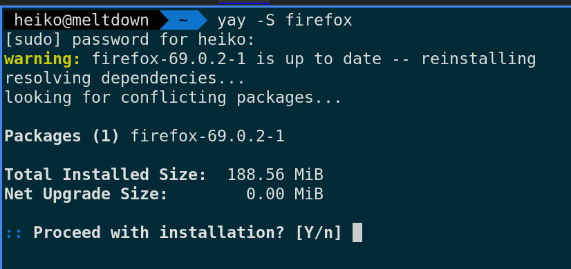{.fragment}
:::
::::::::::::::

## Rechteverwaltung
+ Linux User sind normalerweise keine Systemadmins
+ Adminrechte können mit dem Befehl `sudo` erlangt werden
+ Dabei meist Nachfrage nach dem Nutzerpasswort

. . .

```bash
sudo rm -rf / # niemals ausführen
[sudo] password for $USER:
Sorry, try again.
[sudo] password for $USER:
Sorry, try again.
[sudo] password for $USER:
sudo: 3 incorrect password attempts
```

## Rechteverwaltung
+ User können trotzdem noch viel kaputt machen...
+ ...aber es muss sehr explizit bestätigt werden
+ Euer home ist nur eingeschränkt geschützt

# Nachteile von Linux{data-background-video="img/penguin.mp4"}

## Nachteile
+ Libreoffice und Co. können nicht mit Microsoft Office mithalten
+ Bestimmte Software nicht verfügbar
	+ Adobe Produkte (Photoshop, Indesign, etc.)
+ Spiele
+ Erfordert Einarbeitung

# Windows {data-background-video="img/windows.mp4"}

## Windows
+ Manchmal braucht man noch Windows für $Dinge
+ Voller Umstieg kann schwierig sein

## Dual-Boot
+ Linux kann parallel zu Windows installiert werden
+ Installer erkennen Windows meist automatisch
+ Auswahl des Betriebssystems beim Start des Computers
+ keine Performanceeinbußen

##
### Installer
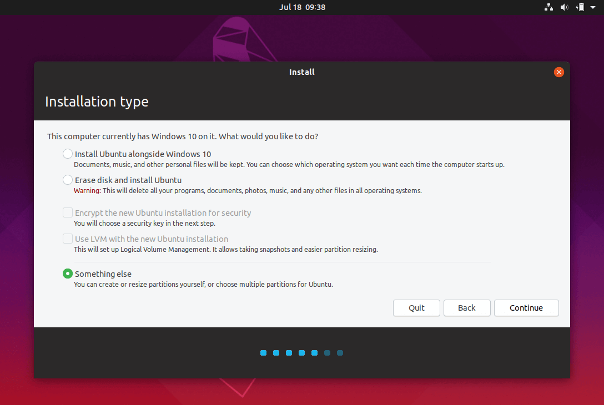{height=500px}

##
### Boot Screen
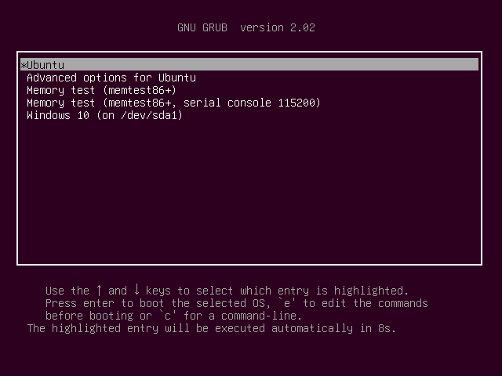

## Virtuelle Maschine (VM)
+ Virtuelle Maschine mit Windows unter Linux
+ gut geeignet für kleine Programmsammlungen
+ etwas schlechtere Performance

## Gnome Boxes
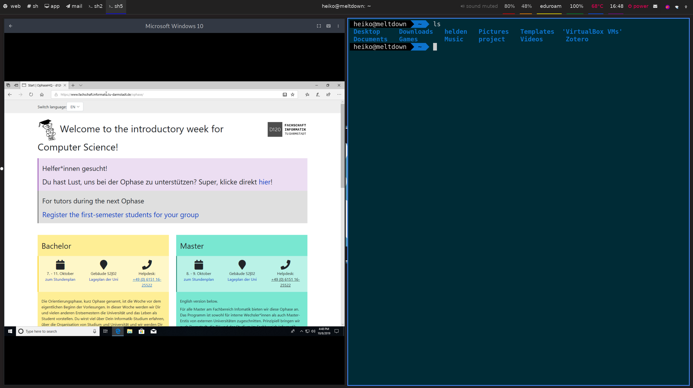

## Wine
+ *Wine Is Not an Emulator*
+ Windows Programme direkt unter Linux ausführen
+ Inzwischen auch in Steam integriert (Proton)
+ Gute Balance zwischen VM und Dual-Boot

# Abschluss {data-background-video="img/end.mp4"}

## Verbreitung von Linux

+ Sehr stark:
	+ Server
	+ Embedded Systems
	+ Supercomputer
	+ Smartphones
+ Noch sehr schwach:
	+ Desktops

## Warum Linux?
+ OpenSource
+ Paketverwaltung
+ mehr Auswahl
+ große Community
+ lernt viel über Betriebssysteme
+ macht das Studium leichter
+ sicherer als Windows

# Fragen {data-background-video="img/question.mp4" }

# Folien
[https://www.d120.de/workshops](https://www.d120.de/workshops)

[https://github.com/miterion/linux-vortrag](https://github.com/miterion/linux-vortrag)

# Linux installieren

## 1. Architektur eures Rechners erfahren
+ 32 oder 64 Bit
+ Windows + Pause oder nach Systeminformationen suchen

##
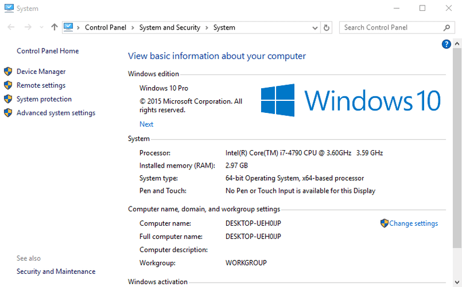

## 2. Distribution und evt. Desktopumgebung gewählt
+ Ubuntu, Fedora, Linux Mint, etc.
+ ggf. Gnome, Cinnamon, KDE, etc.

## 3. LTS ja oder nein
+ falls vorhanden zwischen Long Term Support und „normaler“ Version wählen
+ mit LTS Versionen macht man i.d.R. nichts falsch

## 4. ISO herunterladen

## 5. Mit *etcher* o.ä. auf USB-Stick „brennen“
{height=400px}

## 6. Stick Booten
+ BIOS blendet notwendige Tasten häufig ein
+ oft F12, F1, F2

## 7. Installeranweisungen folgen
